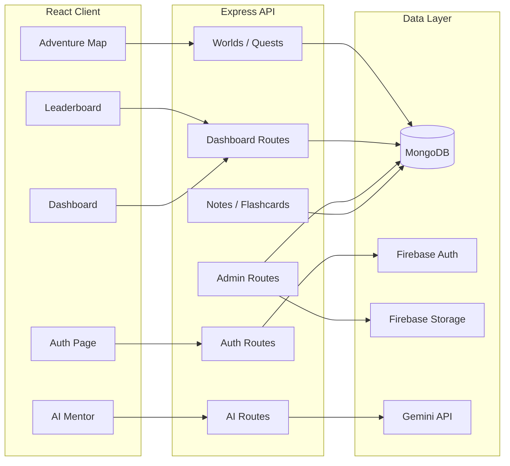

# Architecture

## Runtime Shape

- The client is a Vite SPA with protected routes and a shared shell.
- The backend is a layered Express app with routes, controllers, services, repositories, and models.
- MongoDB is the system of record, with a memory server fallback for local development when `MONGO_URI` is not set.
- Gemini is used for the mentor flow when an API key exists, with a deterministic fallback when it does not.
