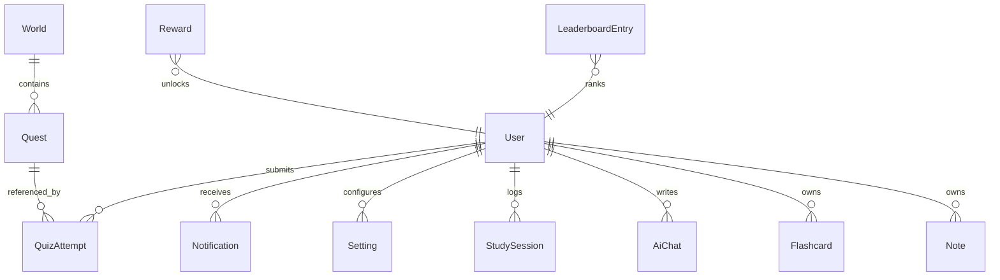

# Database Model

## Collections

- `users` stores account, progression, and streak data.
- `worlds` stores the subject-to-world progression layer.
- `quests` stores mission definitions and boss battles.
- `quizAttempts` stores quiz history and scoring.
- `achievements` stores unlocked trophies.
- `leaderboardEntries` stores rank snapshots.
- `rewards` stores loot shop items and cosmetics.
- `notes` and `flashcards` store study artifacts.
- `aiChats` stores mentor conversations.
- `studySessions` and `settings` store progress and preferences.

## Design Notes

- Collections are intentionally small and denormalized where it keeps reads fast.
- References are used for user-owned artifacts and quiz history.
- Demo data is seeded automatically in development so the app has content on first run.
